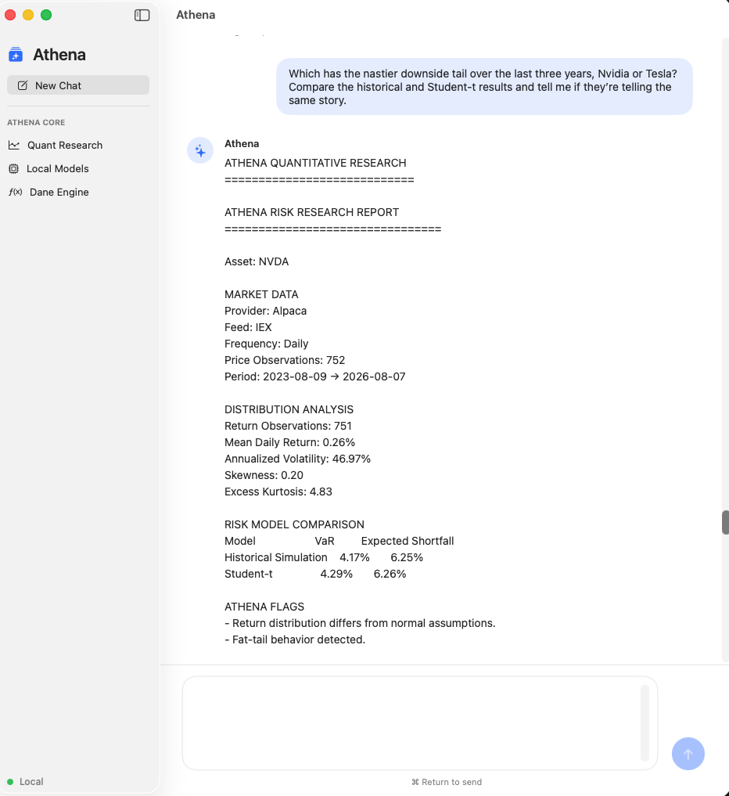

# Athena

**Athena is a local-first multi-agent AI system that routes natural-language requests between specialized local models and deterministic software tools.**

Instead of relying on one general-purpose language model for every task, Athena separates responsibilities across reasoning, research, coding, security review, quantitative analysis, and general assistance.

**AI interprets. Python calculates. Specialized agents collaborate.**

Athena currently includes a working multi-agent orchestration layer, a deterministic quantitative-finance research tool, local model execution through Ollama, a native macOS interface and persistent semantic memory and conversation memory using local embeddings and vector retrieval.

Quantitative research is Athena's first major tool, not its only role. General requests are routed to specialized local models, while structured tasks can be delegated to deterministic tools.

---

## Athena in Action



Athena can take a natural-language request, determine what type of work is required, route it to the appropriate model or tool, and return the completed result through one interface.

Examples include:

- General questions and summarization
- Technical research and comparisons
- Software and architecture reasoning
- Security review
- Quantitative financial research
- Local AI-assisted analysis

---

## Multi-Agent Architecture

Athena uses specialized local models rather than sending every request to the largest available model.

| Role | Responsibility |
|---|---|
| Coordinator | Routes requests to the appropriate specialist |
| General Assistant | Everyday tasks, summaries, organization, and lightweight work |
| Reasoning Agent | Complex analysis, architecture, and strategic reasoning |
| Research Agent | Technical investigation, document analysis, and comparisons |
| Coding Agent | Software development, debugging, and implementation |
| Security & QA Agent | Vulnerability review, code inspection, and adversarial checking |
| Quantitative Analyst | Interpretation of completed quantitative research |
| Memory System | Embeddings, retrieval, and future persistent knowledge |

```text
                           User
                            |
                            v
                       Athena Core
                            |
                            v
                     Request Analysis
                            |
                +-----------+-----------+
                |                       |
          Quantitative?              General
                |                       |
                v                       v
        Quant Research Tool       Agent Router
                |                       |
                |          +------------+-------------+
                |          |            |             |
                |       Research      Coding       Security
                |          |            |             |
                |       Local AI     Local AI      Local AI
                |          \            |            /
                |           \           |           /
                +------------+----------+----------+
                             |
                             v
                       Athena Response
```

The orchestration layer separates model identity from application logic through a registry. This makes it possible to replace or upgrade individual models without redesigning Athena's core routing system.

---

## What Athena Can Do

Athena currently supports both general AI requests and deterministic quantitative research.

A general request such as:

> Compare ChromaDB and FAISS for a local AI memory system.

can be routed to a research-focused local model.

A security request such as:

> Review this Python login code for vulnerabilities.

can be routed to a security-focused model.

A complex systems question such as:

> Design a scalable multi-agent architecture.

can be routed to a larger reasoning model.

A quantitative request such as:

> How ugly is Nvidia one-in-a-hundred left-tail risk over the last five years?

is handled differently. Athena interprets the request, validates the parameters, retrieves market data, and executes the calculations in Python.

The user does not need to know which model, parser, or tool should handle the request.

---

## Tool #1: Quantitative Research

Athena's first major deterministic tool is a quantitative research system for financial assets.

For a request such as:

> Analyze Nvidia downside risk over five years at 99% confidence using Student-t.

Athena can identify:

- Asset: `NVDA`
- Analysis: downside / tail risk
- Historical window: five years
- Confidence level: 99%
- Requested model: Student-t

The workflow is:

```text
Research Question
      |
      v
Asset Resolution
      |
      v
Market Data
      |
      v
Return Series
      |
      v
Distribution Diagnostics
      |
      v
Risk Models
      |
      v
Model Comparison
      |
      v
Structured Report
      |
      v
Local AI Commentary
```

### Current Quantitative Capabilities

- Alpaca market-data integration
- Company and ticker resolution
- Corporate-action-adjusted historical data
- Return-series analysis
- Annualized volatility
- Skewness and excess kurtosis
- Fat-tail diagnostics
- Historical Value at Risk
- Gaussian Value at Risk
- Student-t Value at Risk
- Expected Shortfall
- Cross-model risk comparison
- Monte Carlo simulation
- Structured research reporting
- Local AI interpretation of completed results

The quantitative calculations are performed in Python, not generated by a language model.

## Tool #2: Course-Aware Study Support

Athena can also retrieve indexed course material and use it to generate study content.

For example:

> Make me a practice quiz from my Precalculus homework, sections 2.1–3.5. Show questions first, then answers separately at the end with work.

Athena can:

- search indexed course documents
- identify the relevant topics and sections
- generate original practice questions
- organize problems by skill area
- produce worked solutions separately
- render mathematical notation using Markdown and LaTeX
- preserve the result inside the native macOS interface

Example:


---
## Memory and Document Retrieval

Athena includes a scoped retrieval system for prior conversations and indexed documents.

Natural-language requests such as:

> Find what I wrote about the Revolutionary War.

can be routed to Athena's memory specialist, which searches the appropriate document scope and returns the most relevant source material.

Conversation recall and document retrieval are handled separately so Athena can distinguish between prior chat history and indexed files.
---
## AI Interprets. Python Calculates.

This separation is a core design principle.

```text
Natural Language
      |
      v
Interpretation
      |
      v
Validated Parameters
      |
      v
Deterministic Python
      |
      v
Structured Results
      |
      v
Local AI Explanation
```

Language models are useful for understanding conversational requests and explaining completed results.

They are not treated as the source of truth for calculations that should be reproducible.

When Athena can resolve a request deterministically, it avoids an unnecessary LLM call. When quantitative language is ambiguous, a local model can assist with interpretation, but resolved values are validated before execution.

---

## Native macOS Application

Athena includes a native macOS application built with Swift and SwiftUI.

```text
Athena.app
    |
    v
Natural-Language Message
    |
    v
Athena Core
    |
    v
Agent or Tool
    |
    v
Completed Response
```

The application provides:

- Native SwiftUI interface
- Chat-style interaction
- Natural-language input
- Research progress states
- Scrollable structured responses
- Local model execution
- Direct connection to Athena Core

The interface intentionally contains little reasoning logic. Athena Core remains responsible for orchestration and execution.

---

## Modular Tool Architecture

Athena is designed as a general local AI system with independently maintainable tools.

### Athena Core

Provides:

- Request orchestration
- Multi-agent routing
- Local model execution
- Quantitative research
- Native macOS integration

### Dane Engine

[Dane Engine](https://github.com/dane-anderson/dane-engine) is a separate academic intelligence system for:

- Course-document processing
- Mathematical study workflows
- AI-assisted study generation
- LaTeX generation
- Automated PDF creation

Dane Engine is designed to remain independently maintainable while becoming another specialized capability available through Athena.

---

## Memory Direction

Athena currently indexes supported local documents into a persistent vector store using a local embedding model, retrieves relevant chunks semantically, and stores conversation turns for later recall.

```text
                    Athena Memory
                          |
              +-----------+-----------+
              |                       |
      Structured Memory        Semantic Memory
              |                       |
         Local Database          Vector Store
              |                       |
       Facts / Settings       Conversations
       Preferences            Documents
       Explicit State         Research History
```

Structured facts and settings are better suited to conventional storage, while conversation history and documents benefit from embedding-based retrieval.

A local embedding model is already part of the model stack for future retrieval workflows.

---

## Project Structure

```text
Athena Core/
├── core/
│   ├── orchestrator.py
│   └── fiona_router.py
│
├── staff/
│   ├── employee_registry.py
│   └── agent configuration
│
├── reasoning/
│   ├── parser.py
│   ├── llm_parser.py
│   └── quant_request.py
│
├── quant/
│   ├── alpaca_provider.py
│   ├── analyst.py
│   ├── diagnostics.py
│   ├── entity_resolver.py
│   ├── model_comparison.py
│   ├── risk_engine.py
│   ├── simulation.py
│   ├── tail_risk.py
│   └── report_formatter.py
│
├── tools/
│   └── quant_research.py
│
├── models/
│   └── ollama_client.py
│
├── memory/
├── macos/
│   └── AthenaNative/
├── tests/
└── README.md
```

---

## Engineering Highlights

Athena currently demonstrates:

- Local multi-agent AI orchestration
- Specialized model routing
- Agent and model registry design
- Deterministic tool execution
- Hybrid LLM + Python workflows
- Local inference through Ollama
- Quantitative-finance research pipelines
- Statistical risk modeling
- Monte Carlo simulation
- Real market-data integration
- Native SwiftUI application development
- Automated Python testing
- Modular tool architecture
- Retrieval and memory-system design

---

## Technology

- Python
- Swift
- SwiftUI
- Ollama
- Local large language models
- Alpaca Market Data
- pandas
- NumPy
- SciPy
- pytest
- YAML
- Git
- GitHub
- LaTeX and PDF workflows through Dane Engine

---

## Current Status

Athena is an active AI systems and quantitative-engineering project.

Working components include:

- Native macOS application
- General natural-language interaction
- Multi-agent request routing
- Specialized local-model execution
- Agent/model registry
- Deterministic quantitative request parsing
- Local-LLM fallback interpretation
- Market-data integration
- Distribution and tail-risk analysis
- VaR and Expected Shortfall
- Monte Carlo simulation
- Structured research reports
- Local analyst commentary
- Automated orchestration and quantitative tests
- Persistent semantic document memory
- Conversation memory
- Local embedding-based retrieval
- Incremental school-folder indexing

- Athena is a research and engineering project, not a production trading system.

---

## Next Development Areas

- Dynamic model-based routing
- Multi-agent collaboration on complex tasks
- Hybrid structured and vector memory
- Persistent research sessions
- Document retrieval
- Security review pipelines
- Automated code-review workflows
- Approval gates for sensitive actions
- Portfolio optimization
- Historical stress testing
- Backtesting
- Factor analysis
- Visual research outputs
- Dane Engine integration
- Additional modular tools

---

## Why I Built Athena

Financial research often requires switching between market-data platforms, Python scripts, statistical models, spreadsheets, language models, and reporting tools.

AI development creates a similar problem: different models are good at different tasks, but coordinating them can become its own workflow.

I wanted to explore a different approach:

**Describe the problem in ordinary language and let one local system organize the work.**

Athena combines deterministic software with specialized local AI models rather than treating a single language model as the entire application.

The project is an exploration of AI systems engineering, multi-agent orchestration, quantitative finance, mathematics, local inference, software architecture, and human-computer interaction.

---

## Disclaimer

Athena is an experimental educational and research project.

Quantitative outputs are not financial advice and should not be used as the sole basis for investment, trading, or risk-management decisions.

---

## Author

**Dane Anderson**

Building at the intersection of artificial intelligence, quantitative finance, mathematics, and software engineering.
